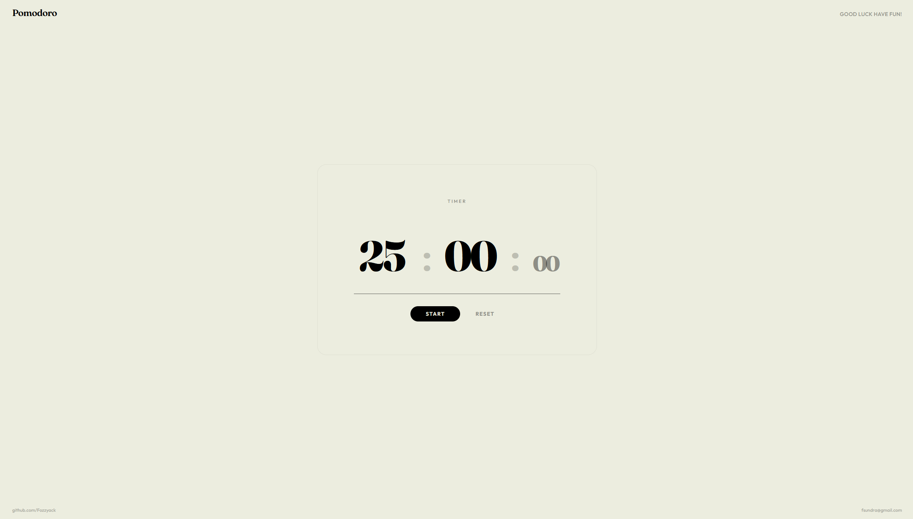

# Pomodoro Timer



A minimal web-based Pomodoro timer built with Go, Chi, plain JavaScript, and Tailwind CSS.

## Features

- Clean timer UI with centisecond precision
- Start, pause, and reset controls
- Click-to-edit timer values (minutes, seconds, centiseconds)
- Automatic 5-minute cooldown after a work session completes
- Mode label that switches between `Timer` and `Cooldown`
- Health endpoint at `/health`

## Tech Stack

- Go (`net/http`)
- [Chi Router](https://github.com/go-chi/chi)
- Vanilla JavaScript
- Tailwind CSS v4

## Run Locally

1. Install dependencies:

```bash
bun install
```

2. Build CSS (if you update styles):

```bash
bunx @tailwindcss/cli -i ./assets/css/style.css -o ./assets/css/output.css
```

3. Start the server:

```bash
go run .
```

4. Open `http://localhost:8080`

You can also choose a custom port:

```bash
go run . -port 3000
```

## Project Structure

```text
.
├── assets/
│   ├── css/
│   └── js/
├── internal/
│   ├── api/
│   ├── app/
│   └── routes/
├── templates/
└── main.go
```
